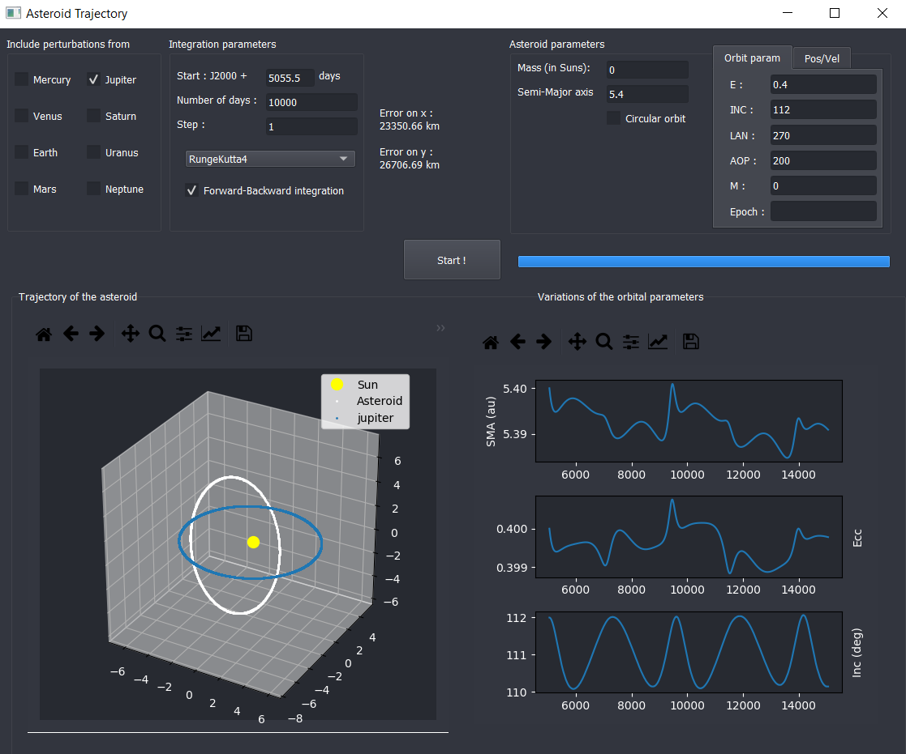

# Asteroid-population

## Overview

This project is part of my CIRI (Cours d’Initiation à la Recherche et à l’Innovation) at IPSA, Paris.

The objective is to model the trajectory of an asteroid in the solar system subject to perturbations from Jupiter. We then study the variations of the orbital parameters such as the semi-major axis, the eccentricity and the inclination after a few centuries. This allows us to visualize the resonances.

We went further by adding all the other planets  in the solar system, which we can choose from using a Graphical User Interface. The orbital parameters of the asteroid are user-defined, as well as the integration parameters.

## How to use

### Running the executable

Simply double click on the file `.exe` file.

### Running the python file

Run the file `main_GUI.py`. This requires PyQt5, Numpy and Matplotlib, so make sure those modules are installed. If not, you can do so by using the command `pip install[module_name]` in your terminal.

### Interface

On the top left corner, choose the planets that will apply perturbations on your asteroid.

In the `Integration parameters` box, enter the date at which your simulation will begin. Type the number of days you want your simulation to run. Enter the step you want. A smaller step will be more accurate, but will take a longer time. 

Choose the integration method you would like to use (Currently, only Runge-Kutta4, more to come…)

Check the box if you want a forward-backward integration. It outputs the error due to the integration step after running. If you want a smaller error, reduce the step and rerun the simulation.

In the `asteroid parameters box`,  enter the mass of your asteroid (in solar masses, so zero, that’s dumb sorry) and the semi-major axis. If your asteroid is on a circular orbit, leave the box checked, otherwise, uncheck it and choose between the two tabs that appeared on the right. The `Pos/Vel` tab allows you to enter the position and velocity of the asteroid in xyz coordinates (bugs, don’t use !), whereas the `orbit param` tab allows you to enter the orbital parameters of your asteroid (Eccentricity, INClination, Longitude of Ascending Node, Argument Of Periapsis, Mean anomaly, and epoch). Values must be entered in DEGREES. Leave epoch = 0 for J2000.

Finally, press `START` to launch the simulation. The graphics will appear, and you can save them using the toolbar on top of them.

Use the **left click** and drag over the the 3d plot to **rotate** it, use **right click** and drag to **zoom**.

If you want to re-run the simulation with other parameters, simply change the desired parameters and click `START` again.

## Currently implemented features

- Multi-body problem, from only the Sun and the asteroid to every planet and the asteroid
- Planet’s trajectory is computed using an accurate model
- Runge-Kutta 4 integrator
- Forward-Backward error estimation
- Asteroid parameters :
  - Circular orbit
  - User defined orbit with parameters
  - User defined orbit with position and velocity
- Plot of the trajectory of every selected body in 3d
- Plot of the orbital parameters changes due to perturbation (only if a planet has been selected)

## TODO

- Option to choose from simplified or accurate planet trajectory model
- more integrators
- input proofing and displaying errors instead of crashing the program
- Logging
- Saving the results to a file for use in Excel for example
- Improve Performance
- re-write some functions in C++ to improve performance 
