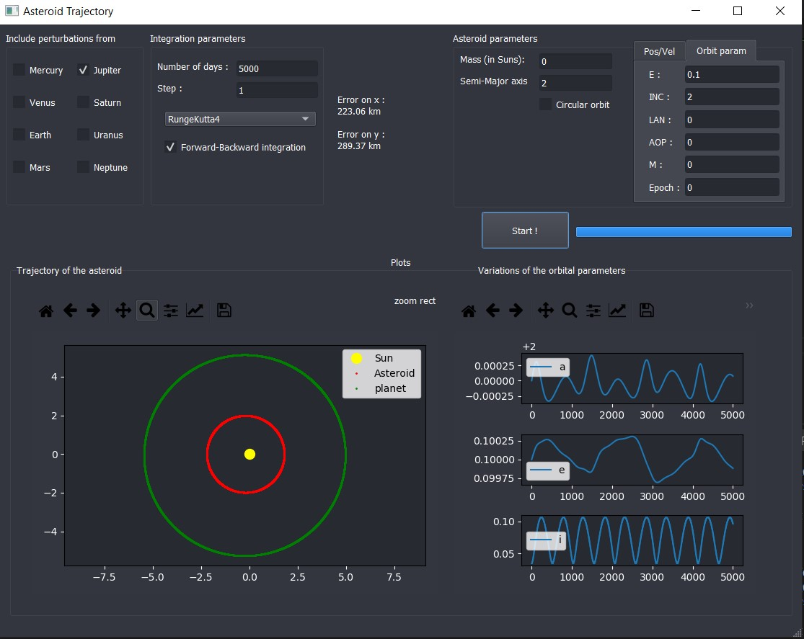

# Asteroid-population

School project as part of the CIRI at IPSA. 

The objective is to modelize the trajectory of an asteroid in the solar system. At the term of the project, we should be able to model a specific asteroid using all its orbital parameters, subjected to perturbations from other bodies such as :

- the Sun
- Jupiter
- all other planets of the solar system.

We can study the variations of semi-major axis, eccentricity and inclination over a few thousand days.
The current integrator is RungeKutta4.

[Work in progress...]

2 python files are available :

- `main_GUI.py` for the interface (PyQt5 is needed)
- `asteroid_trajectory.py` is the basic program, with no interface

## Currently implemented features

- 2 body problem (only the sun and the asteroid)
- 3 body problem 
  - Only Jupiter available for now
- Planet’s trajectory is computed using an accurate model
- Runge-Kutta 4 integrator
- Forward-Backward error estimation
- Asteroid parameters :
  - Circular orbit
  - User defined orbit with parameters
  - User defined orbit with position and velocity
- Plot of the trajectory of the bodies
- plot of the orbital parameters changes due to perturbation (only in 3 body problem)

### Current state of the UI :

## TODO

- N-body problem
- Other planets
- Option to choose from simplified or accurate planet trajectory model
- more integrators
- input proofing and displaying errors instead of crashing the program

## Dependencies 
- Numpy
- Matplotlib
- PyQt5 (only for the GUI)
